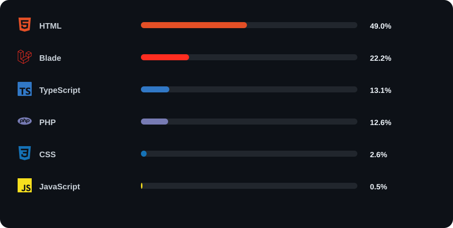
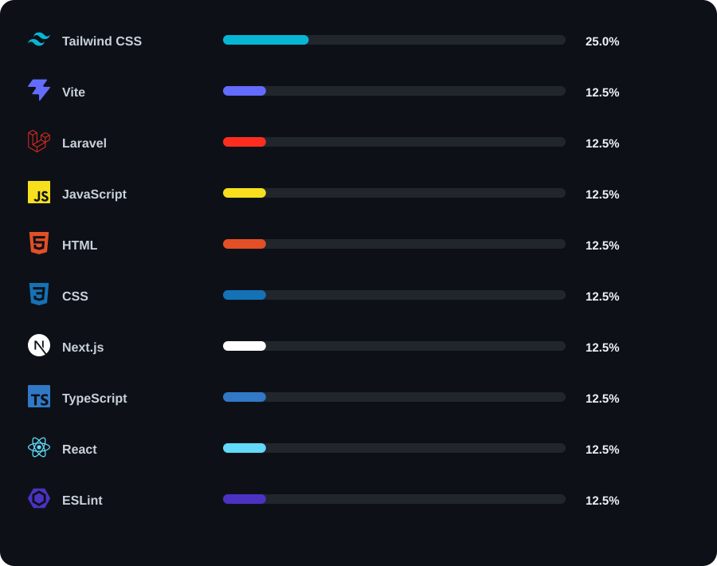

<div align="center">

# Muhammad Raka Irhamna

### Full-Stack Developer

Building modern web applications and exploring backend architecture,
deployment, and scalable software systems.

<br>

<a href="https://github.com/rakayriii">

</a>

</div>

---

## About Me

I'm a developer focused on building real-world web applications
and continuously improving my skills through hands-on projects.

- 💻 Full-Stack Web Development
- 🔥 Laravel & PHP
- ⚡ Next.js, React & TypeScript
- 🐳 Docker & containerized development
- 🐧 Linux development environment
- 🗄️ Backend & database development
- ☁️ Exploring cloud deployment
- 🧠 Learning system design and software architecture

---

# ⚡ Technology Stack

> Automatically generated from my GitHub repositories.

### Languages

<div align="center">



</div>

### Frameworks & Technologies

<div align="center">



</div>

---

# 📊 Technology Usage

The statistics above are automatically calculated from my repositories.

When I build a project using a new language, framework, or technology,
the technology can automatically appear in this section after the next scan.

```text
New Project
     │
     ▼
GitHub Repository
     │
     ▼
Technology Detection
     │
     ▼
Statistics Calculation
     │
     ▼
SVG Generation
     │
     ▼
README Update


<!-- LANGUAGES_START -->
<div align="center">


</div>
<!-- LANGUAGES_END -->


<!-- FRAMEWORKS_START -->
<div align="center">


</div>
<!-- FRAMEWORKS_END -->
